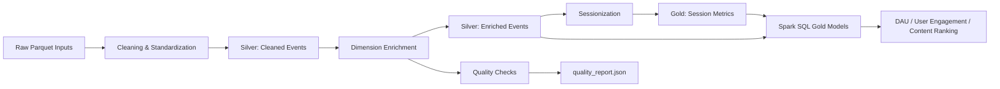

# User Behavior Analytics Platform

This project is a portfolio-grade batch analytics platform built with PySpark. It is designed to demonstrate senior data engineering skills across architecture, SQL, Python engineering, data quality, and distributed data processing.

## What It Shows

- medallion-style data architecture using `raw -> silver -> gold -> quality`
- Spark DataFrame transformations for cleaning, joins, and sessionization
- Spark SQL for business-facing analytics models
- explicit data quality checks covering schema assumptions, duplicate keys, invalid ranges, and orphan dimension references
- code organized into `jobs`, `pipeline`, `transformations`, `quality`, `sql`, and `utils`

## Architecture



## Data Model

### Raw

- `user_events.parquet`
- `users.parquet`
- `content.parquet`

### Silver

- `cleaned_events.parquet`
- `enriched_events.parquet`
- `sessionized_events.parquet`

### Gold

- `session_metrics.parquet`
- `daily_active_users.parquet`
- `user_engagement.parquet`
- `content_ranking.parquet`

### Quality

- `quality_report.json`

## Key Engineering Decisions

### 1. DataFrame API for transformation-heavy stages

Cleaning, deduplication, timestamp parsing, enrichment, and sessionization are implemented with the DataFrame API because these stages are easier to compose and test in Python.

### 2. SQL for presentation-ready analytics

Gold reporting models use Spark SQL from standalone `.sql` files to show SQL fluency and make analytics definitions easy to review.

### 3. Data quality as a first-class output

The pipeline does not only produce analytics tables. It also produces a structured quality report so downstream users can inspect invalid event types, timestamp parsing issues, duplicate IDs, and missing dimension references.

## Project Structure

```text
analytics_spark_project/
  jobs/              entrypoints for data generation and pipeline execution
  pipeline/          orchestration and settings
  quality/           data quality checks and reporting
  sql/               Spark SQL models for gold tables
  transformations/   cleaning, joins, sessionization
  utils/             Spark session and IO helpers
  data/              raw, silver, gold, and quality outputs
```

## How to Run

```bash
python3.12 -m venv .venv
source .venv/bin/activate
pip install -e '.[dev]'
python -m domains.analytics_spark_project.jobs.generate_data --event-count 100000
python -m domains.analytics_spark_project.jobs.run_pipeline --top-n-content 10
```

Use Python 3.11 or 3.12 for local execution. PySpark 3.5 is not a reliable target on Python 3.14.

## What to Highlight in Interviews

- how the sessionization logic works with window functions and inactivity gaps
- why broadcast joins are appropriate for small dimensions
- how SQL and DataFrame APIs are combined instead of forcing one style everywhere
- how quality checks protect analytics trustworthiness
- how the current local design can evolve into orchestrated cloud execution
